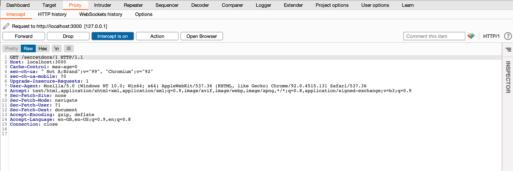
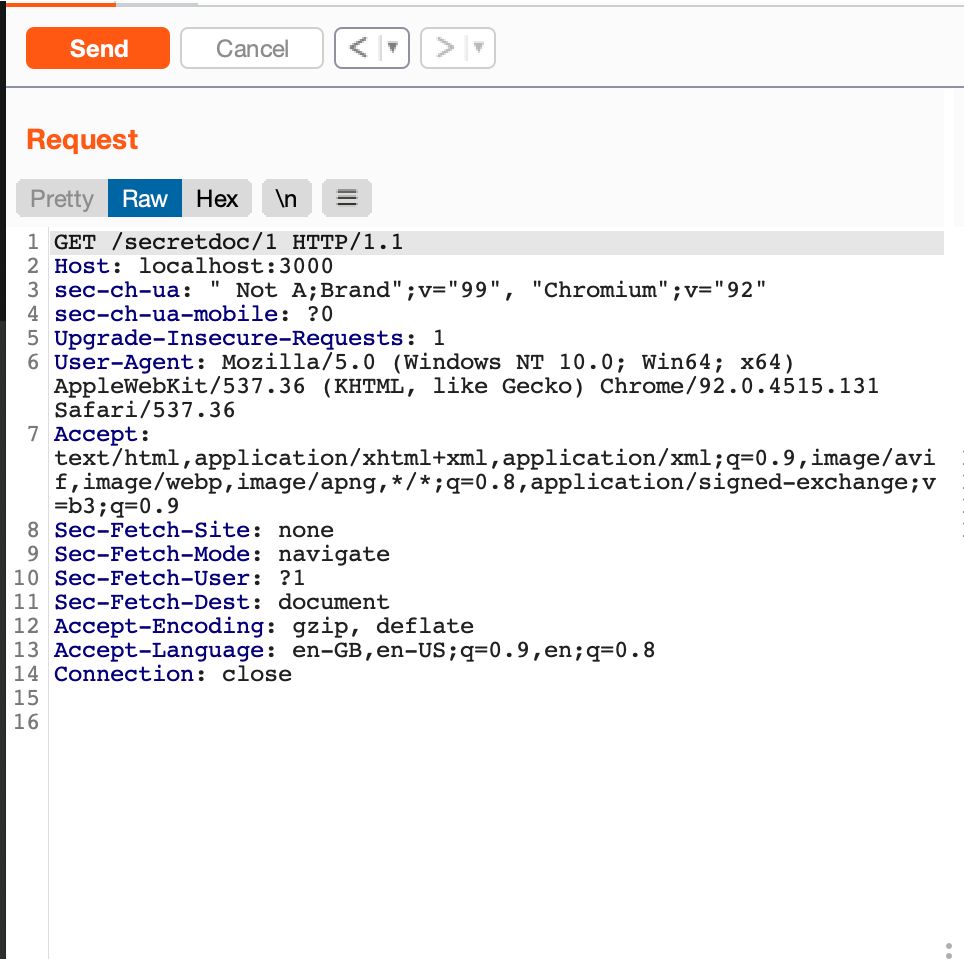
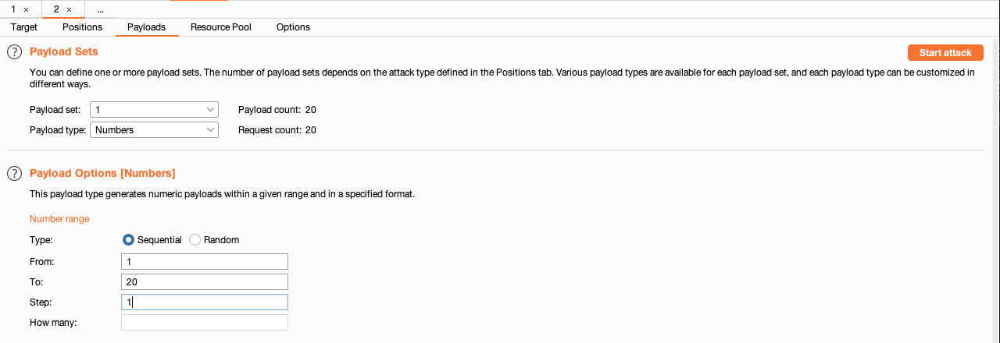

# Simulating Broken Object Level Authorization with Burp Suite

## Scenario
You are a user from Bank A and you use the API : http://localhost:3000/secretdoc/{id} to access secret documents.
<br/>Bank A has 5 documents with the system and Bank B has 1 document with the system. 

Having the ID of the document allow you to access the particular document. As the documents are considered secret, a organization's document should not be exposed to a user from another organization.
<br/><br/>
Bank A documents ID are from 1 to 5 and Bank B document ID is 6.<br/>
Assume that you are logged in as a user from Bank A.

## Setup
Please download Burp Suite Community Edition [here](https://portswigger.net/burp/communitydownload).
Run the simulation API app by calling this command:
```
node app.js
```

## Using Burp Suite
1. Start Burp Suite Community Edition and Create a new Temporary Project, Select use Burp Defaults and Start Burp.
   
2. Configure Proxy by clicking on Proxy Tab.

3. Click Open Browser. This will open a chrome-like browser by BurpSuite.

4. Navigate to http://localhost:3000/secretdoc/1 and you will see the request being intercepted in the BurpSuite app. Click on Forward to allow the request to go through.


7. A txt file with the name "bankA.txt" should be successfully downloaded. If you click on HTTP History in Burp Suite you will also see more details of the request.

## Repeater to find vulnerability
Repeater allow you to easily modify the request and repeat the request with modifications. This allow a tester to use known values that a user should not be authorized to access to determine if the proper control is in place.

1. From HTTP History right click on a request and Send the Request to Repeater. You may see the Repeater tab turn orange.

2. Click on the Repeater tab. You should see a raw HTTP Request in Burp Suite. This is how Http Request are usually send.


3. By manipulating the ID manually here, you can repeat the request and attempt to find if there are unauthorized paths that users can access. Try changing GET /secretdoc/1 to GET /secretdoc/2 . Click send and see the response.

4. If you change the ID to 6, you will gain access to Bank B's document. This shows that this endpoint has not been protected to prevent unauthorized access.

## Intruder to find vulnerability
Intruder allows your to determine a pattern and automatically send request based on the pattern selected. This allows you to send a request many times. For example to test for incremental id, we can set it to attack type "sniper" with a payload type "number". This allow the user to set a range of numbers to test the request to find vulnerability.

1. From HTTP History right click on a request and Send the Request to Intruder. You may see the Intruder tab turn orange
   
2. Click on the Intruder Tab and then navigate to Positions.

3. You will see a raw HTTP Request in this page and you have to click on the Add § button to add a character at the front and back of the id. This will tell Burp Suite that this is the variable you would like to attack.


4. Click on Payloads. Select Numbers for Payload type.

5. Enter 1 for From, 20 for To and 1 for Step.


6. Click on start attack. Look at the results to see if the request return a Successful or Error code.

## Test for vulnerability for the other paths as well
/secretdoc/protected/1 (Try 1 - 6 in Intruder/Repeater) </br>
/secretdoc/uuid/00a2553f-cf87-477a-8d66-d495ccaae864 (Is it easy to find a way to get the next UUID?) </br>

Are you able to find the same vulnerability? Why?

*Status 403 stands for forbidden and it means that the server is aware that the user is not authorized to access the particular resource.

## Troubleshooting Burp Suite
Do refer to BurpSuite's [troubleshooting site](https://portswigger.net/burp/documentation/desktop/troubleshooting) if you are unable to replicate any of the instructions above.