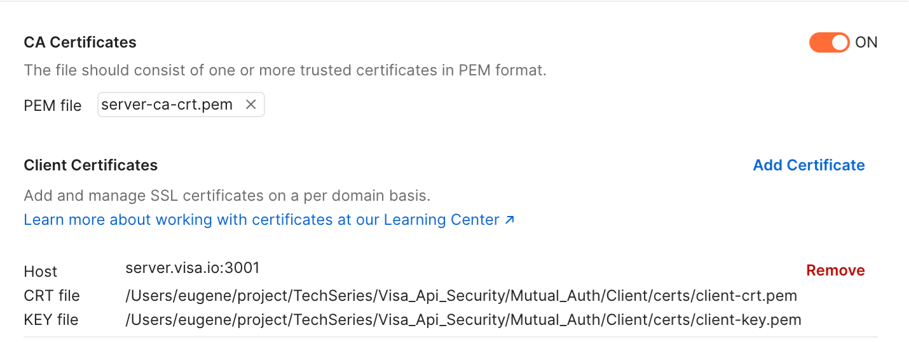

# Visa Hands-On Exercises @ SMU Tech Series

## Introduction
There are 3 different Hands-On exercises on API Security in this repository.
1. Basic Authentication
2. Mutual Authentication
3. X-Pay-Token Authentication

Each of this exercises are stored in their respective folder with a Server and Client folder. The Server serves are a API provider and Client serves as a API consumer.

## Setup
You will need NodeJs for this exercises. You can install NodeJs from here: https://nodejs.org/en/
The recommended IDE (Code Editor) for the exercises is Visual Studio Code.

In addition, do register this custom addresses to your hosts file so that the sample URLS can be used for this exercises:

### For Mac
1. Open Terminal

2. Navigate to etc folder by entering this command into terminal
```
cd /etc
```

3. Type in the folllowing command to edit the host address
```
sudo nano /etc/hosts
```
You will be prompted to enter password. Enter your Mac's password

4. Paste in this 2 address to the button of the file
```
127.0.0.1 server.visa.io
127.0.0.1 client.bankA.io
```
Press Control X to exit from file indicate Yes to save changes.

### For Windows
Follow this [website](https://support.managed.com/kb/a683/how-to-modify-your-hosts-file-so-you-can-work-on-a-site-that-is-not-yet-live.aspx) and add the same address in the file below
```
127.0.0.1 server.visa.io
127.0.0.1 client.bankA.io
```
Close and save the file.

### Install Node Modules
Open the project in Visual Studio and run npm install in your command prompt/powershell/terminal from the project directory.

## Testing your Code
Run node.js from the Server and Client folder for each Authentication exercise to check if the implementation is successful.
You can run the app by calling this command on Terminal in Visual Studio Code

```
node app.js
```
A shell script and powershell script (startup.sh/startup.ps1) has been written to help start the project easily. You will be prompted to enter the project you want to start. Either either Basic_Auth , Mutual_Auth or XPayToken to start the project you woul like to test.

Start the shell script (startup.sh) on a Mac machine using this command
```
    ./start.sh
```

Start the powershell script (startup.ps1) on a Windows machine using this command
```
    powershell .\startup.ps1
```

You can also import the Postman collection in the repository to test that the Server is working correctly. For Mutual Auth's call to work on Postman. Do ensure that the Cert is configured in the Postman Settings.


## References
* https://support.managed.com/kb/a683/how-to-modify-your-hosts-file-so-you-can-work-on-a-site-that-is-not-yet-live.aspx 
* https://www.matteomattei.com/client-and-server-ssl-mutual-authentication-with-nodejs/ * 
* https://www.npmjs.com/package/basic-auth 
* https://www.npmjs.com/package/crypto 
* https://developer.visa.com/pages/working-with-visa-apis/x-pay-token 
* http://definitelytyped.org/docs/node--node-0.8.8/interfaces/https.requestoptions.html 